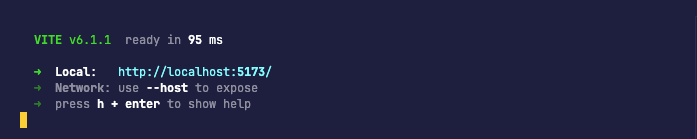
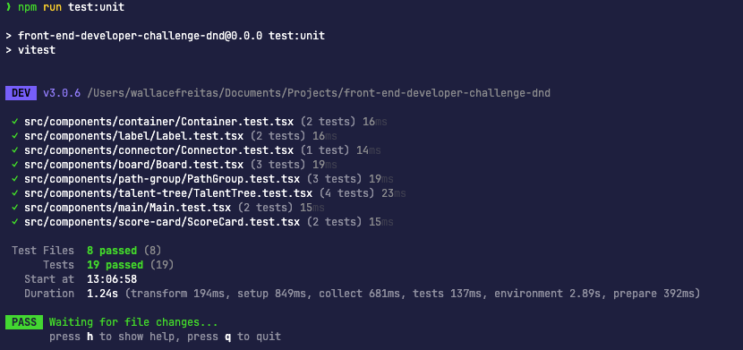
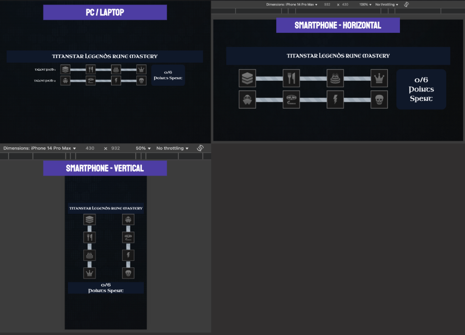
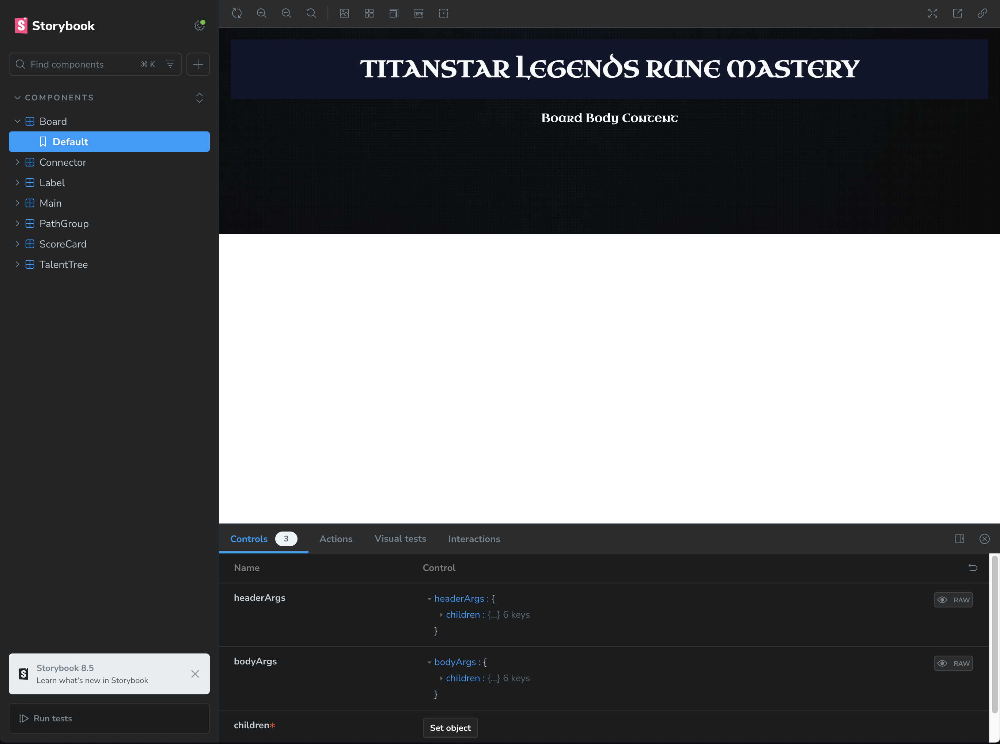

## 🚀 DnDBeyond Challenge

This project was build using React (Vite), Styled Components and Storybook

Below I explained a little of patterns:

Composition Pattern

Used destructuring of components into smaller parts in order to ensure their flexibility and scalability

## 🔥 Prerequisites

Before you begin, ensure you have the following installed on your machine:

- Node.js (>= 22.x)
- npm (>= 11.x)

## 🧙‍♂️ Instructions

- [Instructions Here](./instructions/README.md)

## 💾 Installation

1. Clone the repository:

```sh
# Clone this repository
$ git clone https://github.com/wallacefreitas/front-end-developer-challenge.git

# Access project folder
cd front-end-developer-challenge
```

2. Install the dependencies:

```sh
npm install
```

## 👟 Running the Application

1. Start the application:

```sh
npm run dev
```



## ⏱️ Running Tests

1. Run the unit tests:

```sh
npm run test:unit
```



## 📂 Project Structure

```sh
front-end-developer-challenge/
├── src/
│   ├── assets/
│   │   ├── fonts/
│   │   ├── images/
│   ├── components/
│   ├── context/
│   ├── hooks/
│   ├── shared/
│   │   ├── utils/
│   ├── App.tsx
│   ├── global.css
│   ├── index.css
│   └── main.tsx
├── index.html
├── package.json
├── tsconfig.json
└── vite.config.ts
```

## ⚙️ Services

| Description (App) | Host                  | Port |
| :---------------- | :-------------------- | :--: |
| application       | http://localhost:5173 | 5173 |
| storybook         | http://localhost:6006 | 6006 |

## 📷 Screenshots

Responsive screens:



Accessing Storybook:



## 🔮 Future Implementations

✓ Improve coverage of tests <br>

## 📝 License

This project is under license MIT.

Made with ♥️ by Wallace de Freitas 👋🏻
